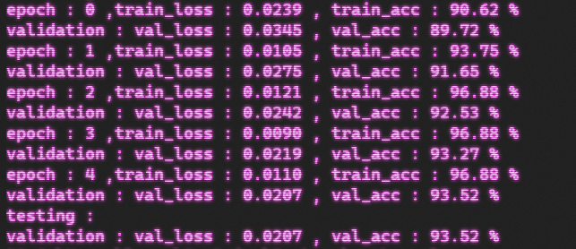

# autograd_numpy
## This lil thing was done so i can visualize a quick prototype of what i will do in c++ with gpu support and more operations later.
## Implementations of the basic supported operations are at [ml/autograd](ml/autograd/), and some other operations are composition of multiple basic ops. 
## Optimizers (i will propably add more and use this thingy to quickly test an algorithm before implementing it in c++) are at [ml/nn/Optimizers](ml/nn/Optimizers.py)
## Losses like cosine similarity cross entropy etc are at [ml/nn/Losses](ml/nn/Losses.py)
## The main Variable class that represents a tensor of parameters is at [ml/Variable](ml/Variable.py)
## Update: there is now an option to use cuda (only cupy supported for now but its extensible) however if there is no such package installed in a system the program can still run normally using only numpy (maybe , i think , i hope) , it can be somewhat slow sometimes and i havent fully tested it so it may just break 
## Theres also an example with the mnist dataset doing handwritten digits classification the results are below :

